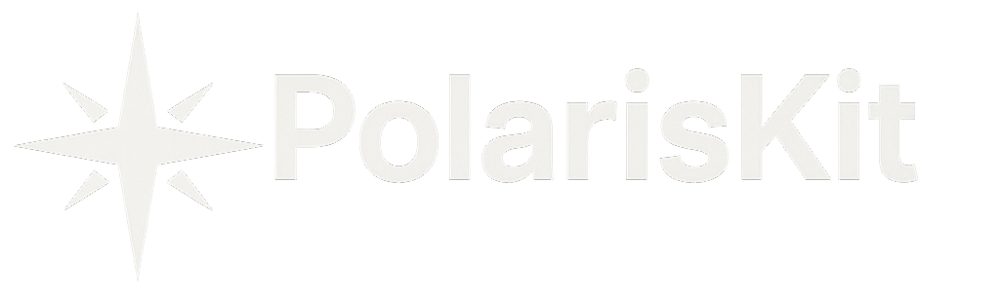
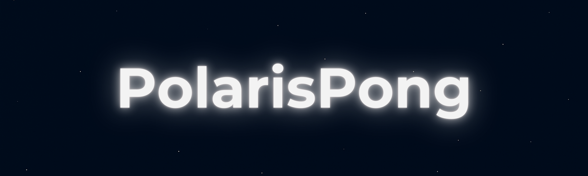

# 🌌 Marco Gonzalez

Founder of SB Studios | Full Stack Dev · Game Designer · Builder

 

## 👋 About Me

Hi, I'm Marco, a developer and designer working across games, tools, music, and hardware under the SB Studios banner.

## What I Work On
- 🎮 [Polaris Studios]: 2D games & custom engine tooling (Galactic Tour 64, Callisto’s Trial)
- 🧪 [Nebulab]: Developer utilities and web tools (ZPL Generator, Portfolio Tools)
- 🎵 [Shineburst]: Music, vinyl, and creative expression (Original Music, Merch Vinyls)
- 🕹️ [Lunarcade Studios]: Hardware builds and retro game projects (Desktop Arcade Cabinet)
- 🍰 [M⌒o’s Bakery]: Cozy-themed experimental baking brand (Branding, Merch)
- 🌌 [Mosaic Skies]: Astrophotography, Space Visuals, and Celestial Art

---

## 🛠️ Tech Stack

### Languages & Frameworks

### Tools & Platforms

## 📦 Published Products

A modular Python toolkit for beginner game developers.
Built on Pygame, it includes scene management, transitions, audio handling, save/load, and a debug-ready pause menu.

**Perfect for:** Students • Solo Devs • 2D Game Projects

[📥 Purchase on Ko-fi](https://ko-fi.com/s/523b453cae)

---

A complete pong-style game showcasing PolarisKit's capabilities.

**Features:**
- ✅ 4 Game Modes
- 🎨 Full Customization (Paddles, Balls, Fields)
- 🏆 Achievement System
- 🎮 Retro M64 Styling

[📥 Purchase on Ko-fi](https://ko-fi.com/s/6a0170822f)

## 🚀 Current Projects

  
<b>🧩 PolarisKit Core</b> | Modular Pygame Starter Kit

   

  **Status:**  
  **Tech Stack:** Python, Pygame

  Comprehensive game development toolkit featuring:
  - 🎬 Scene Management System
  - ⏸️ Advanced Pause Menu
  - 💾 Save/Load Functionality
  - 🔊 Audio Management
  - 📐 Scalable Project Structure

  **Links:** [Ko-fi Product](https://ko-fi.com/s/523b453cae)

---

  
<b>🎮 PolarisKit Controller Expansion</b> | Gamepad Support

   

  **Status:**  
  **Tech Stack:** Python, Pygame, SDL2

  Adding seamless gamepad support with:
  - 🎮 Plug-and-Play Detection
  - ⌨️ Automatic Keyboard Fallback
  - 🔄 Input Abstraction Layer
  - 🎯 Multiple Controller Support

---

  
<b>🗺️ PolarisKit Tiled Expansion</b> | Map Editor Integration 

   

  **Status:**  
  **Tech Stack:** Python, Pygame, Tiled

  Load and render Tiled maps with the PolarisTileEngine:
  - 🗺️ TMX/TSX File Support
  - 🎨 Multi-Layer Rendering
  - 🚪 Object Layer Parsing
  - ⚡ Optimized Tile Rendering

---

  
<b>🏎️ Galactic Tour 64</b> | Top-Down Arcade Racer

   

  **Status:**  
  **Tech Stack:** Python, Pygame, Tiled

  Features:
  - 🏁 Multiple Racing Cups
  - 🏆 Trophy & Unlock System
  - 🎮 CC Class Progression
  - 🎵 Original M64-Style Soundtrack

  **Links:** [Showcase Repo](https://github.com/marcogonzalez99/GalacticKart64Showcase)

---

  
<b>👽 Cosmic Invaders</b> | Roguelike Space Shooter

   

  **Status:**  
  **Tech Stack:** Python, Pygame, Tiled

  A Space Invaders remake with roguelike elements:
  - 🌳 Skill Tree Progression
  - 🎨 Ship Customization
  - 🎲 Procedural Enemy Waves
  - ⚡ Power-Up System

---

  
<b>💻 SB Studios Website</b> | Central Hub for All Branches

   

  **Status:**  
  **Tech Stack:** Astro, Sanity CMS, Typescript

  Features:
  - 📱 Responsive Design
  - 📝 Dynamic Content Management
  - 🎨 Branch-Specific Pages
  - 🛒 Product Integration

---

  
<b>🎮 M64 Custom Console</b> | Hardware Gaming Device

   

  **Status:**  
  **Tech Stack:** Raspberry Pi, 3D Printing, Electronics

  A compact gaming console designed from scratch:
  - 🖨️ Custom Case Design
  - 🔌 Hardware Wiring & Assembly
  - 🎮 Original Game Support
  - 📺 HDMI Output

---

## 🔗 Explore Showcases

| Project | Description | Link |
|---------|-------------|------|
| 🧩 **PolarisKit** | 2D Game Engine | [View](https://github.com/marcogonzalez99/PolarisKitShowcase) |
| 🌙 **Callisto's Trial** | Space Themed Rogue-like | [View](https://github.com/marcogonzalez99/CallistosTrialShowcase) |
| 🏓 **PolarisPong** | Pong Remake | [View](https://github.com/marcogonzalez99/PolarisPongShowcase) |
| 🏎️ **Galactic Tour 64** | Arcade Racing Game | [View](https://github.com/marcogonzalez99/GalacticKart64Showcase) |

## 🔐 About Code Access

> 💼 **For Employers, Recruiters, & Collaborators**

Most of my work lives in **private repositories** to protect the IP behind SB Studios games, tools, and hardware projects.
I'm a solo developer building original content from the ground up, from the game engine to the physical console.

📩 **Want to see the source code?**  
Send me a message! I'm happy to grant access or walk through the architecture, design decisions, and technical stack.

## 📫 Connect With Me

**or just drop a ⭐️ on something cool**

