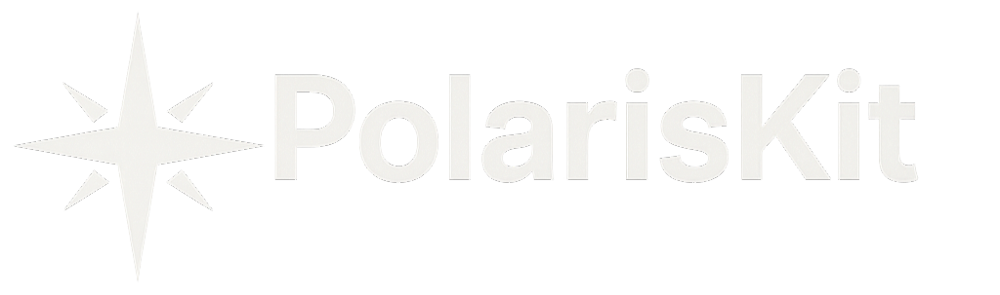
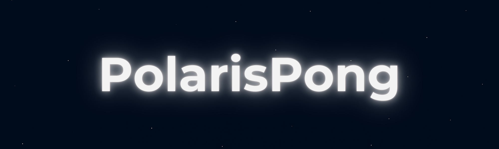

## 👋 About Me

Solo Developer, Game Designer, and Creative Technologist with a passion for building original games, tools, and hardware projects. I founded SB Studios to bring my creative visions to life across multiple branches, from game development to music and even astrophotography.

## 🏢 What I Work On
- 🎮 **PolarisStudios**: 2D games & custom engine tooling (Galactic Tour 64, Callisto’s Trial)
- 🧪 **Nebulab**: Developer utilities and web tools (ZPL Generator, Portfolio Tools)
- 🎵 **Shineburst**: Music, vinyl, and creative expression (Original Music, Merch Vinyls)
- 🕹️ **Lunarcade Studios**: Hardware builds and retro game projects (Desktop Arcade Cabinet)
- 🍰 **M⌒o’s Bakery**: Cozy-themed experimental baking brand (Branding, Merch)
- 🌌 **Mosaic Skies**: Astrophotography, Space Visuals, and Celestial Art

## 🛠️ Tech Stack

### Languages & Frameworks

### Tools & Platforms

## 📦 Published Products

<table width="100%">
  <tr>
    <td width="50%" valign="top" align="center">
        
         
        

          <strong>PolarisKit</strong> is a 2D game framework for Pygame focused on modular design and scaleability. 
          It features scene stacking, lifecycle hooks, transition management, audio systems, persistent saves, and resolution-aware layout utilities, all organized for scalable development.
            
          <strong>Ideal for:</strong> Indie developers • Educators
            
          <a href="https://github.com/marcogonzalez99/PolarisKit">🔍 View Showcase</a>
          <a href="https://ko-fi.com/s/523b453cae">📥 Purchase on Ko-fi</a>
        

    </td>
    <td width="50%" valign="top" align="center">
        
         
        

          <strong>PolarisPong</strong> is a polished, replayable Pong-inspired arcade game, and the first complete game built on <strong>PolarisKit</strong>. 
          It showcases the full framework in action: scene flow, transitions, audio, persistent saves, achievements, and deep customization.
            
          <strong>Highlights:</strong> Multiple modes • Achievements (saved between sessions) • Skins & backgrounds • Secret challenge + Hall of Fame
            
          <a href="https://github.com/marcogonzalez99/PolarisPongShowcase">🔍 View Showcase</a>
          <a href="https://ko-fi.com/s/6a0170822f">📥 Purchase on Ko-fi</a>
        

    </td>
  </tr>
</table>

## 🚀 Current Projects

<table width="100%">
  <tr>
    <td width="50%" valign="top">

  ### 🧩 PolarisKit Core
  **Modular Pygame Starter Kit**

  

  **Tech Stack:** Python, Pygame  
  **Showcase**: [View Here!](https://github.com/marcogonzalez99/PolarisKitShowcase)  
  **Get Free on Kofi!**: [Download Here!](https://ko-fi.com/s/523b453cae)  

  Comprehensive game development toolkit featuring:
  - 🎬 Scene Management System
  - ⏸️ Advanced Pause Menu
  - 💾 Save/Load Functionality
  - 🔊 Audio Management
  - 📐 Scalable Project Structure

  </td>
    <td width="50%" valign="top">

### 🎮 PolarisKit Controller Expansion
**Gamepad Support Module**

**Tech Stack:** Python, Pygame, SDL2  
**Showcase:** [View Here!](https://github.com/marcogonzalez99/PolarisKitControllerExpansionShowcase)

Adding seamless gamepad support with:
- 🎮 Plug-and-Play Detection
- ⌨️ Automatic Keyboard Fallback
- 🔄 Input Abstraction Layer
- 🎯 Multiple Controller Support

</td>
  </tr>
  <tr>
    <td width="50%" valign="top">

### 🗺️ PolarisKit Tiled Expansion
**Map Editor Integration**

**Tech Stack:** Python, Pygame, Tiled  
**Showcase:** [View Here!](https://github.com/marcogonzalez99/PolarisKitTiledExpansionShowcase)

Load and render Tiled maps with the PolarisTileEngine:
- 🗺️ TMX/TSX File Support
- 🎨 Multi-Layer Rendering
- 🚪 Object Layer Parsing
- ⚡ Optimized Tile Rendering

</td>
    <td width="50%" valign="top">

### 🏎️ Galactic Tour 64
**Top-Down Arcade Racer**

 

**Tech Stack:** Python, Pygame, Tiled  
**Showcase:** [View Here!](https://github.com/marcogonzalez99/GalacticKart64Showcase)

Features:
- 🏁 Multiple Racing Cups
- 🏆 Trophy & Unlock System
- 🎮 CC Class Progression
- 🎵 Original M64-Style Soundtrack

</td>
  </tr>
  <tr>
    <td width="50%" valign="top">

### 👽 Cosmic Invaders
**Roguelike Space Shooter**

**Tech Stack:** Python, Pygame  
**Showcase:** [View Here!](https://github.com/marcogonzalez99/CosmicInvadersShowcase)

A Space Invaders remake with roguelike elements:
- 🌳 Skill Tree Progression
- 🎨 Ship Customization
- 🎲 Procedural Enemy Waves
- ⚡ Power-Up System

</td>
    <td width="50%" valign="top">

### 💻 SB Studios Website
**Central Hub for All Branches**

**Tech Stack:** Astro, Sanity CMS, TypeScript

Features:
- 📱 Responsive Design
- 📝 Dynamic Content Management
- 🎨 Branch-Specific Pages
- 🛒 Product Integration

</td>
  </tr>
  <tr>
    <td width="50%" valign="top">

### 🎮 M64 Custom Console
**Hardware Gaming Device**

**Tech Stack:** Raspberry Pi, 3D Printing, Electronics

A compact gaming console designed from scratch:
- 🖨️ Custom Case Design
- 🔌 Hardware Wiring & Assembly
- 🎮 Original Game Support
- 📺 HDMI Output

</td>
    <td width="50%" valign="top">

### 🌐 Pathways
**Custom Link In Bio Website**

**Tech Stack:** Astro, TailwindCSS, Typescript  
**Live Link**: *Coming Soon!*  
**Showcase:** [View Here!](https://github.com/marcogonzalez99/PathwaysShowcase)

A link in bio website, allowing for quick navigation across all branches of SB Studios
- 🎨 Personal
- 🧗‍♂️ SkyHolds
- 🎵 Shineburst
- 🎮 PolarisStudios

</td>
  </tr>
</table>

## 🔐 About Code Access

> 💼 **For Employers, Recruiters, & Collaborators**

Most of my work lives in **private repositories** to protect the IP behind SB Studios games, tools, and hardware projects.
I'm a solo developer building original content from the ground up, from the game engine to the physical console.

📩 **Want to see the source code?**  
Send me a message! I'm happy to grant access or walk through the architecture, design decisions, and technical stack.

## 📫 Connect With Me

**or just drop a ⭐️ on something cool**

